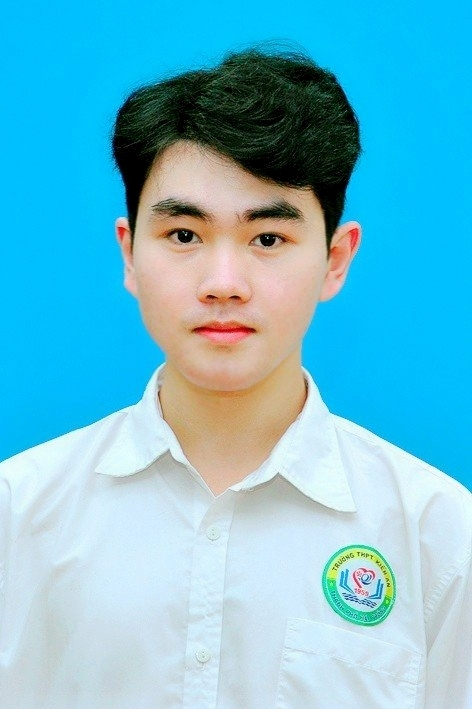

<!--
  ẢNH: upload file ảnh của bạn vào repo này (sangdaden/sangdaden) với tên "sang.jpg"
  (nút "Add file" → "Upload files" trên GitHub). Ảnh sẽ tự hiện ở dưới.
  Mẹo: muốn ảnh tròn thì crop ảnh thành hình vuông/tròn trước khi upload.
-->

  

<h1 align="center">Hi, I'm Lê Bảo 👋</h1>

  <b>AI Engineer</b> · Hai Phong City, Vietnam 🇻🇳 
  <i>Building practical applications with large language models.</i> 
  <i>Xây dựng ứng dụng thực tế với các mô hình ngôn ngữ lớn.</i>

  

  

---

### 🇻🇳 Giới thiệu / About

🇻🇳 Mình là một sinh viên Công nghệ Thông tin định hướng trở thành AI Engineer, yêu thích việc xây dựng các sản phẩm AI giải quyết bài toán thực tế. Mình quan tâm đến Machine Learning, NLP, Generative AI, AI Agents và các hệ thống RAG, đồng thời luôn tìm cách biến ý tưởng thành những ứng dụng hữu ích cho người dùng.

🇬🇧 I am an Information Technology student aspiring to become an AI Engineer, passionate about building AI-powered products that solve real-world problems. My interests include Machine Learning, NLP, Generative AI, AI Agents, and Retrieval-Augmented Generation (RAG), with a strong focus on turning AI technologies into practical and impactful applications.

---

### 🚀 Featured Projects / Dự án nổi bật

| Project | Description | Links |
|----------|------------|-------|
| **LegalQA** | AI-powered legal question answering system that enables users to retrieve and understand legal information through natural language queries. Combines NLP, semantic retrieval, and LLM-based reasoning to generate accurate and context-aware responses. *Python · NLP · RAG · LLMs* | [Code](https://github.com/Baole13/LegalQA) |
| **Tetris AI Agent** | Autonomous Tetris player built using heuristic search and state evaluation. Simulates all valid block placements and selects optimal actions based on features such as holes, aggregate height, bumpiness, and completed lines. *Python · Pygame · Game AI* | [Code](https://github.com/Baole13/AI-contest) |
| **ChatbotPTIT** | AI-powered university assistant designed to support PTIT students through natural language interaction. Integrates Large Language Models and retrieval techniques to provide information about academic programs, regulations, and student services in a conversational manner. *Python · NLP · LLMs · RAG* | [Code](https://github.com/Baole13/ChatbotPTIT) |

<!-- ➡️ **Xem tất cả tại portfolio / See everything:** **https://sangdaden.github.io/portfolio-2025/** -->

---

### 🛠️ Tech Stack

**Focus:** Machine Learning · Deep Learning · Natural Language Processing (NLP) · Large Language Models (LLMs) · Retrieval-Augmented Generation (RAG)

---

<!-- ### 📊 GitHub Stats

  
  

 -->

<i>🐝 Be a better bee!!!</i>

